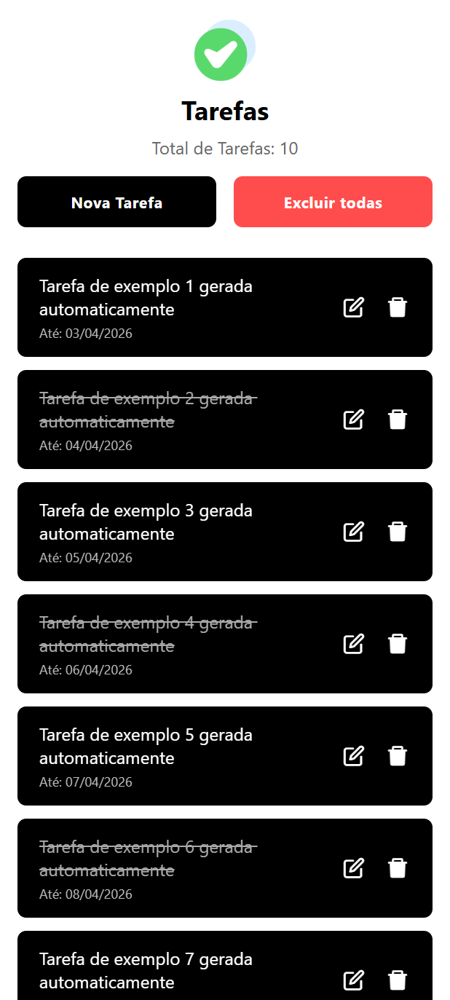

# 📝 Desafio Prático: Elevando a Interface com Modais, Pressables e Extensões

Seja bem-vindo(a) a mais um desafio prático de React Native! O objetivo desta atividade é evoluir a interface do aplicativo de tarefas implementando fluxos de "Experiência de Usuário" (UX) modernos, utilizando botões interativos avançados e pacotes nativos muito usados criados pela comunidade Expo.

## 🎯 Tópicos Abordados

Neste exercício, você terá contato direto com novas abordagens fundamentais:

- **Sobreposição e Pop-ups:** O uso do Core Component `<Modal>` para isolar o ambiente de adição e edição.
- **Interações Avançadas:** Substituição da limitação do antigo `<Button>` simples usando `<Pressable>` focado nos efeitos de "pressionar".
- **Ecossistema e Bibliotecas Comunitárias do Expo:** Instalação e uso em interface de componentes externos (`expo-checkbox` e `@react-native-community/datetimepicker`).
- **Estados Compostos:** Gestão síncrona de Textos, Arrays, Objetos Nulos e Booleanos.

---

## 🚀 Passo a Passo das Tarefas

Abaixo estão os requisitos para você implementar e melhorar no código existente. Cumpra um de cada vez!

### 1. Modernizando os Botões Clássicos (Pressable)
Atualmente temos botões genéricos nativos ou interações contínuas. Queremos um design empolgante para os botões do controlador de ações.

- **🎯 Objetivo:** Remova os componentes `<Button>` básicos em favor de `<Pressable>`.
- **Efeitos no Toque e Pressão**: A grande mágica do `Pressable` em relação à `<TouchableOpacity>` é a estilização inteligente baseada em função. No `style={...}` do componente, use o parâmetro `({ pressed })` para retornar diferentes configurações de Layout.
- Dica Mestre: Construa para seus estilos de botão os efeitos combinados de `transform: [{ scale: 0.98 }]`, além de pequenas alterações de sombra no campo `elevation` do Android para simular que o botão foi fisicamente "afundado".

### 2. Interface Flutuante e Isolada (`<Modal>`)
Uma área com vários campos e complexidades de agendamento de tarefas ficaria mal na "barra superior" atual. Precisamos de uma sobreposição.

- **🎯 Objetivo:** Construa um `<Modal>` para focar a atenção do usuário e encapsular a lógica da elaboração/edição.
- Modifique seu código extraindo o trecho de formulário (que cria a nova tarefa).
- No lugar que o form ocupava, insira a recém-criada área de de ações usando o `<Pressable>` com escrito de "Nova Tarefa" perto do botão de Excluir tudo.
- Declare dentro do `App.tsx` na "raiz" um elemento `<Modal>`. Ele só deverá ser renderizado utilizando as propriedades `visible={modalVisible}` baseados nos novos Hooks de seu State, permitindo que a tela escureça (use uma cor rgba pra isso no componente interno dele) e mostre a janela de título, input e de salvar por cima de todo o resto.

### 3. Usando Plugins da Comunidade e Formulando Data e Checkboxes
Nosso backend avançou nas suas abstrações de dados incluindo Data Limite (`dueDate`) e se uma dada tarefa foi finalizada ou não (`completed`).

- **🎯 Objetivo:** Insira controladores e leitores gráficos dentro de seu Modal.
- Abra o terminal e insira no projeto as bibliotecas compatíveis: `npx expo install expo-checkbox @react-native-community/datetimepicker`.
- Utilize o pacote `expo-checkbox` para ler se e escrever visualmente os estados condicionais booleanos da tarefa sendo digitada. (Checkbox para "Marcar como Concluída").
- Mostre o componente `DateTimePicker` sobre demanda (após a pessoa clicar textualmente numa possível data base), extraindo o estado do calendário que devolverá eventos contendo instâncias nativas da classe `Date`. Converta isto com as funções `.toLocaleDateString()` pro usuário ao retornar a janela da Tarefa, informando o que foi salvo amigavelmente no novo card e, posteriormente, enviando tudo em pacotes ao `handle-api.ts`.

### 4. Feedbacks Visuais Específicos para a Listagem
Se passamos a obter detalhes das tarefas agora, devemos visualizar de forma inteligente!

- Vá para as visualizações de item (`TaskItem.tsx` e `TaskList.tsx`).
- Insira uma seção ou um subtexto revelador indicando quando uma tarefa possui um vencimento/`dueDate`.
- **Textos Riscados**: Quando passarmos o array ao mapeamento, verifique o campo `{task.completed}` de todo item gerado. Caso se mostre que é verídico (`true`), ative o estilo nativo de fonte de decorações: adicione e condicione dinamicamente num vetor para que um certo `textDecorationLine: 'line-through'` passe do topo a fim de ilustrar àquela meta descartada. 

---

Vá com paciência! Esta tarefa engloba uma interligação grande entre a parte Estrutural/FrontEnd e a parte Funcional (estados da interface e comunicação externa). Teste as adições de Checkbox e das bibliotecas externas passo a passo sem pressa. 🚀 E não se esqueça de testar sua usabilidade!
